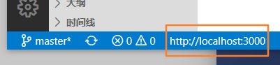

# runserverless

本插件现在正式更名为`runserverless`，并指定版本号为`1.0.0`

`runserverless`插件的作用是模拟一个云函数系统，不需要额外的操作即可快速的指定一个目录作为静态资源目录，并兼具编写云函数的功能。

## 启动方法

在资源管理器的任意目录上鼠标右键，在菜单中选择 `runserverless`，即可创建一个基于`nodejs`的`http`服务器,默认是3000端口，如果端口被占用会自动搜索未占用的端口，并指定本服务器为该端口,如下图所示：


在底部的状态栏会显示当前正在运行的服务器地址，以及静态资源目录的地址



此时该目录的静态资源就可以以该资源相对于静态根目录的相对路径作为`url`地址被访问了。

按住`ctrl + shift + p`调用面板命令，输入`stopserverless`命令，即可停止静态资源服务器
## 编写云函数
在静态资源目录下，有`api`  `data`  `assets`  `utils`这几个目录是特殊的，它们下的资源不会被响应。
而`api`目录下被指定为编写云函数的目录，比如：`/api/index.js`的代码如下：
```js
module.exports = (req, res) => {
    res.send('ok')
}
```
当访问`/api/index`的时候，会响应`ok`。
这里编写的云函数规则与`express`的路由句柄形式是相同的。
注意：模块语法暂时只支持`commonjs`风格。

## 下次升级

本次的 `api`目录下的接口暂不支持目录的嵌套，也就是说 `/api/common/home.js`是会报错的，通过`/api/common/home`是无法请求对应接口的。

计划再 1.0.1的版本中升级该功能。