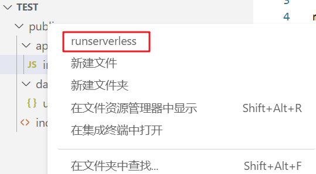

# runserver

## 使用方法

在资源管理器的任意目录上鼠标右键，在菜单中选择 `runserver`，即可在http环境中预览页面,默认是3000端口，暂时不支持自定义端口，因此保持3000端口未被占用

在底部的状态栏会显示当前正在运行的服务器

按住`ctrl + shift + p`调用面板命令，输入`stopserver`命令，即可停止静态资源服务器

## 0.1.1升级
1. 优化了文件列表界面
2. 服务器性能有了提升
